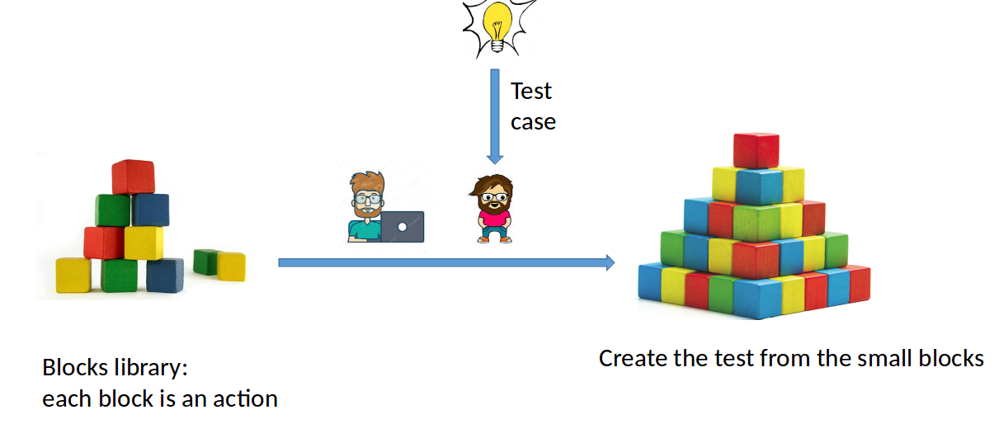
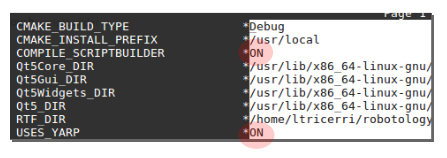
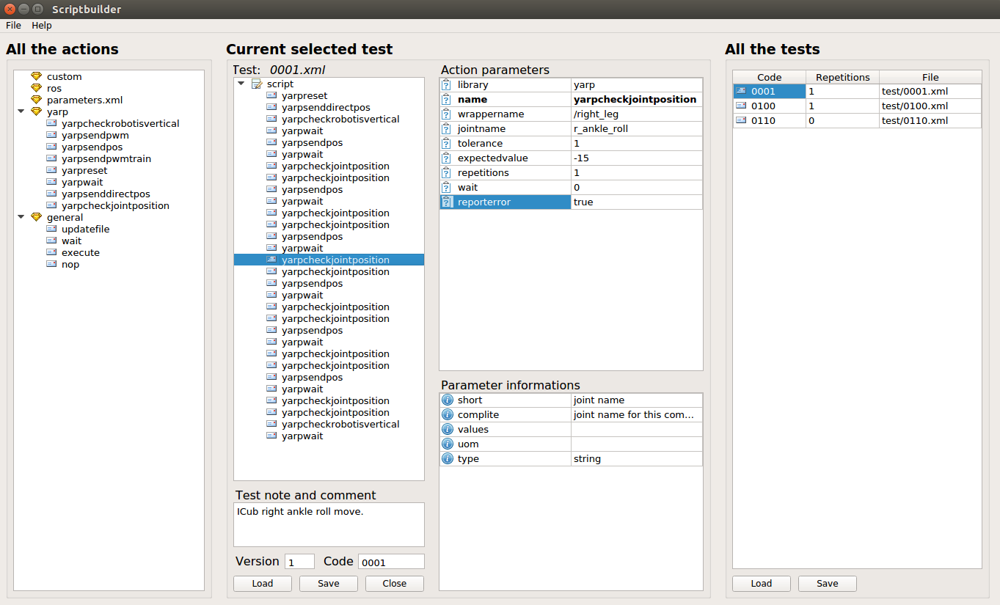

# 1. Maintainers


| | CI and deployment |
|:---:|:---:|
| [](https://github.com/niNicogenecogene) | [@Nicogene](https://github.com/Nicogene) |

| | Development |
|:---:|:---:|
| [](https://github.com/triccyx) | [@triccyx](https://github.com/triccyx) |

# 2. CI Status


# 3. Block Test

- [1. Maintainers](#1-maintainers)
- [2. CI Status](#2-ci-status)
- [3. Block Test](#3-block-test)
- [4. Introduction](#4-introduction)
- [5. Installation](#5-installation)
  - [5.1. External library](#51-external-library)
  - [5.2. Prerequisite Linux](#52-prerequisite-linux)
    - [5.2.1. Dependencies](#521-dependencies)
    - [5.2.2. Source-based Dependencies](#522-source-based-dependencies)
    - [5.2.3. Numpy](#523-numpy)
  - [5.3. Prerequisite Windows](#53-prerequisite-windows)
  - [5.4. Installation and compilation](#54-installation-and-compilation)
- [6. Test writing](#6-test-writing)
  - [6.1. General Settings](#61-general-settings)
  - [6.2. Library Settings](#62-library-settings)
  - [6.3. Prerequisites](#63-prerequisites)
  - [6.4. Test list](#64-test-list)
    - [6.4.1. Parallel or series execution](#641-parallel-or-series-execution)
    - [6.4.2. Repetitions](#642-repetitions)
  - [6.5. Finally the test](#65-finally-the-test)
    - [6.5.1. Generic commands](#651-generic-commands)
  - [6.6. Test writing with Scriptbuilder](#66-test-writing-with-scriptbuilder)
- [7. Parametric test](#7-parametric-test)
  - [7.1. Table](#71-table)
  - [7.2. Using the parameter](#72-using-the-parameter)
  - [7.3. Examples](#73-examples)
- [8. Test execution](#8-test-execution)
  - [8.1. Test folder struct](#81-test-folder-struct)
  - [8.2. Test execution of custom folder](#82-test-execution-of-custom-folder)
    - [8.2.1. Troubleshoot](#821-troubleshoot)
- [9. Logging](#9-logging)
  - [9.1. Application logging](#91-application-logging)
  - [9.2. Sensors logging](#92-sensors-logging)
  - [9.3. Plot logging](#93-plot-logging)
  - [9.4. Report](#94-report)
- [10. Specific plugin](#10-specific-plugin)
  - [10.1. Existing plugins](#101-existing-plugins)
  - [10.2. Create a new plugin](#102-create-a-new-plugin)
  - [10.3. Create a new repository for the plugin](#103-create-a-new-repository-for-the-plugin)
  - [10.4. Create plugin initialization](#104-create-plugin-initialization)
  - [10.5. Blocks writing](#105-blocks-writing)
  - [10.6. XML files](#106-xml-files)
- [11. Gazebo](#11-gazebo)
  - [11.1. Speed up model creation](#111-speed-up-model-creation)
  - [11.2. World file](#112-world-file)
- [12. Authors](#12-authors)


# 4. Introduction

The main idea of BlockTest is to adopt testing methodologies and best practices adopted in the software industry and propose their use in robotic applications within the robotics community.  BlockTest allows developers to build a test that verifies the correct functioning of a robotic component, be it a piece of hardware (e.g. a robotic arm) or a piece of software (e.g. an algorithm). The main idea is to provide a set of basic blocks that can be composed to build more complex tests, without writing new code. The rationale behind this approach is that tests should be easy to write and, more importantly, should not require debugging efforts. Writing tests by combining existing, already debugged, components guarantees that no effort is required to debug the tests themselves. BlockTest is also written to provide support for running system components (e.g. a robot simulator), and robotic middleware. This can be achieved by extending the framework providing plugin libraries that export functionalities for a new middleware if needed. At the moment of writing, BlockTest already supports YARP, while ROS support is under development.
(See Figure below).
<br/><br/>



<br/><br/>

# 5. Installation

Supported OS: Linux Ubuntu 18.04 and Windows 10.
Boost library version must be >=1.65.
CMake must be > 3.12.

## 5.1. External library

The following libraries are used in blocktest:  
  
**pugixml** https://github.com/zeux/pugixml  
**exprtk** https://github.com/ArashPartow/exprtk  
**boost** https://www.boost.org/  
**YCM**   https://github.com/robotology/ycm

## 5.2. Prerequisite Linux

### 5.2.1. Dependencies

```bash
sudo apt-get install -y cmake git libboost-all-dev qtbase5-dev qtdeclarative5-dev qtmultimedia5-dev libqt5opengl5-dev libqcustomplot-dev
```
### 5.2.2. Source-based Dependencies

- `YCM`

```bash
$ git clone https://github.com/robotology/ycm
$ cd ycm
$ mkdir build && cd build
$ cmake ..
$ make
$ make install <optional>
```
Add in your bashrc:

```
export CMAKE_PREFIX_PATH=${CMAKE_PREFIX_PATH}:/<build/install_dir_of_ycm>
```
Instead, if you use robotology_superbuild in .bashrc:
```
export CMAKE_PREFIX_PATH=:${ROBOTOLOGY_SUPERBUILD_BUILD_DIR}/src/YCM

export ROBOTOLOGY_SUPERBUILD_INSTALL_DIR=<path to your robotology install dir>
source ${ROBOTOLOGY_SUPERBUILD_INSTALL_DIR}/share/robotology-superbuild/setup.sh

```

### 5.2.3. Numpy

Optionally you can install numpy for plotting purposes:

```bash
sudo apt install python3-pip
pip3 install numpy
pip3 install matplotlib
```

## 5.3. Prerequisite Windows

```bash
vcpkg install boost:x86-windows
vcpkg install pugixml
```
Qt5 from binary https://doc.qt.io/qt-5/windows.html

## 5.4. Installation and compilation

To compile just execute the following commands in a bash
terminal.
```bash
git clone https://github.com/robotology/blocktest     
cd blocktest
mkdir build
cd build
cmake ..
make -j 4
```

Or it is possible to select the Scriptbuilder integration options. Note that it is active by default.

```bash
ccmake ..
<select options>
<type c>
<type g>
<type e>

```


Select your preferred installation folder using:
CMAKE_INSTALL_PREFIX <br>
Suggested location (also if you use blocktest plugins):
```
~\blocktest\install
```
It is possible also to run `blocktestrunner` and `Scriptbuilder` from any folder, you have just to define `BLOCKTEST_RESOURCE_PATH` where all the plugins, xmltemplate, and test folder
are stored.

If you are using the [`robotology-superbuild`](https://github.com/robotology/robotology-superbuild) with the `ROBOT_TESTING` profile enabled, the variable is already exported by the superbuild setup scripts.
# 6. Test writing

For easy test writing, you can skip directly to the section [Scriptbuilder](##5.6.-test-writing-with-scriptbuilder). You can use the test writing tool called ScriptBuilder.  <br>
Otherwise, the starting point for writing a test is the file ./test/test.xml, see below.

```xml
    <testlist repetitions="1">a

   <settings  realrobot="false" onlysimcommands="yarpcheckrobotisvertical checkRobot yarpreset applyForce"  
            neverexecutecommands="" logseverity="debug" loggingtime="0.01"  tablename="test/tables/main.tab" 
            waitcommand="yarpwait" nowcommand="yarpnow" loggingcommand="infologgeryarp"/> <!--loggingtime in sec-->

    <!--Prerequisites-->
    <prerequisite enabled="true" command="yarpserver" waitafter="5000" param="--silent" prefix="" kill="true"/>
    <prerequisite enabled="false" command="gzserver" waitafter="5000" param="--verbose -e ode --profile ode_default -slibgazebo_yarp_clock.so icub.world" prefix="" kill="true"/>
    <prerequisite enabled="true" command="gzserver" waitafter="5000" param="--verbose -e ode --profile ode_default -slibgazebo_yarp_clock.so icub_fixed.world" prefix="" kill="true"/>
    <prerequisite enabled="false" command="gzclient" waitafter="5000" param="" prefix="" kill="true"/>


    <!--Libraries-->
    <library enabled="true" path="genericactiondepotlib/libgenericactiondepot.so" name="genericactiondepot" note="System generic action library"/>
    <library enabled="true" path="yarpactiondepotlib/libyarpactiondepot.so" name="yarpactiondepot" note="Yarp action library" />

    <!--Libraries settings-->
    <librarysettings enabled="true" name="genericactiondepot"/>
    <librarysettings enabled="true" name="yarpactiondepot" wrappername="/right_leg /left_leg /torso /head /right_arm /left_arm" robotname="icubSim" netclock="true"/>
   
    
    <!--**************************-->
    <!--**********Tests***********-->
    <!--**************************-->

    <!--ICub pos && directpos-->
    <test file="test//0001.xml" repetitions="2" name="ICub right ankle roll move"  code="0001"  loggingtype="position" loggingwrappername="/right_leg" loggingpart="r_ankle_roll r_ankle_pitch"/>

    </testlist>   
```

This file contains:
 * the simulation general settings
 * the blocktest used shared libraries
 * the prerequisites
 * the tests link list

## 6.1. General Settings

```xml
<settings robotname="icubSim" realrobot="false" onlysimcommands="yarpcheckrobotisvertical checkRobot yarpreset applyForce" netclock="true" 
            neverexecutecommands="" logseverity="debug" loggingtime="0.01"  tablename="test/tables/main.tab" 
            waitcommand="yarpwait" nowcommand="yarpnow" loggingcommand="infologgeryarp" relativetime="false" unixtime="true"/>
```

| Param name           | Default value        | Comment                                                                                        |
| -------------------- | -------------------- | ---------------------------------------------------------------------------------------------- |
| realrobot            | false                | Indicates if it is a real robot under test (true), or it is a Gazebo (false)simulation                       |
| onlysimcommands      | yarpreset applyForce | Indicates which are the commands to be executed only in simulation (realrobot param)                            |
| neverexecutecommands | ---                  | Indicates which are the commands not to be executed.                                           |
| logseverity          | info                 | Indicates the severity to be logged in log.log                                                 |
| loggingtime          | 0.01                 | Indicates the time in seconds for logging joints info if are required in the test.             |
| tablename            | test/tables/main.tab | Indicates the table name for parametric value                                                  |
| waitcommand          | wait                 | Indicates the command blocks to be used for wait                                               |
| nowcommand           | now                  | Indicates the command blocks to be used for now                                                |
| loggingcommand       | infologgeryarp       | Indicates the command blocks to be used for logging                                            |
| relativetime         | true                 | The logging time is relative(from test start) or absolute                                      |
| unixtime             | false                | If the time is absolute it can be Unix time format or string format                            |

## 6.2. Library Settings
In this section, it is possible to specify the plugin library to be used.

```xml
<library enabled="true" path="genericactiondepotlib/libgenericactiondepot.so" name="genericactiondepot" note="System generic action library"/>
<library enabled="true" path="yarpactiondepotlib/libyarpactiondepot.so" name="yarpactiondepot" note="Yarp action library" />
```

| Param name | Default value | Comment                          |
| ---------- | ------------- | -------------------------------- |
| enabled    | true          | If these settings will be loaded |
| name       | ---           | library tag name                 |
| path       | ---           | library .so relative path from blocktest |
| note       | ---           | Explanation notes |

```xml
<!--Libraries settings-->
<librarysettings enabled="true" name="genericactiondepot"/>

<librarysettings enabled="true" name="yarpactiondepot" wrappername="/right_leg /left_leg /torso /head /right_arm /left_arm" robotname="icubSim" netclock="true"/>
```

| Param name | Default value | Comment                       |
| ---------- | ------------- | ----------------------------- |
| enabled    | true          | If the library will be loaded |
| name       | ---           | library tag name              |
| note       | ---           | Explanation notes             |
| robotname            | icubSim              | Robot name to be used
| netclock             | true                 | Indicates if the network clock (Yarp) should be used. In the case, it is used the one on "/clock" port |
In this section, it is also possible to specify the plugin library settings.


## 6.3. Prerequisites

The prerequisites are applications to be executed before the tests, if
necessary, and their parameters.

```xml
 <prerequisite enabled="true" command="gzserver" waitafter="5000" param="--verbose -e ode --profile ode_default -slibgazebo_yarp_clock.so icub_fixed.world" prefix="" kill="true"/>
```
| Param name | Default value | Comment                                                          |
| ---------- | ------------- | ---------------------------------------------------------------- |
| enabled    | true          | If the prerequisite will be loaded                               |
| command    | ---           | Command to be executed.                                          |
| waitafter  | 5000          | Time to wait after command execution.                            |
| param      | ---           | Command parameters.                                              |
| prefix     | ---           | Command prefixes.                                                |
| kill       | true          | The current prerequisite will be killed at the end of the tests. |


## 6.4. Test list

The test list includes all the tests written. The test list, basically,
list the tests together with the **file** in which the test has been written.

```xml
<test file="test//0001.xml" repetitions="2" repetitionsfortime="" name="ICub right ankle  roll move"  code="0001"  parallel="false"/>

<test file="test//0100.xml" repetitions="2" repetitionsfortime="" name="ICub right ankle roll pwm injection"  code="0100"  parallel="false"/>

<test file="test//0110.xml" repetitions="0" repetitionsfortime="" name="ICub right ankle roll pwmtrain injection"  code="0110" parallel="false"/>

```

| Param name         | Default value | Comment                                                                                          |
| ------------------ | ------------- | ------------------------------------------------------------------------------------------------ |
| file               | ---           | File in which the test is written.                                                               |
| repetitions        | 1             | How many times the test is repeated.                                                             |
| name               | ---           | Test name.                                                                                       |
| code               | ---           | Numeric code for identifying the test, could be related to the test case.                            |
| parallel           | false         | Should the test be executed in parallel.                                                         |
| repetitionsfortime | 0             | If specified is the time to repeat the test in seconds.                                                     |

### 6.4.1. Parallel or series execution
It is possible to specify if some tests are executed in series or parallel.

```xml
<test file="test//0001.xml" repetitions="1" repetitionsfortime="" name="xxx"  code="0001"  parallel="false"/>
<test file="test//0002.xml" repetitions="1" repetitionsfortime="" name="xxx"  code="0002"  parallel="true"/>
<test file="test//0003.xml" repetitions="1" repetitionsfortime="" name="xxx"  code="0003"  parallel="true"/>
<test file="test//0004.xml" repetitions="1" repetitionsfortime="" name="xxx"  code="0004"  parallel="true"/>
<test file="test//0005.xml" repetitions="1" repetitionsfortime="" name="xxx"  code="0005"  parallel="false"/>
```
In the above example the tests will be executed in the following way:

**0001** start in series

**0002-0003-0004** start in parallel when 0001 is finished

**0005** start when all 0002-0003-0004 are finished

In the case, it is possible to insert a dummy test in series to align the following tests executions.

### 6.4.2. Repetitions
Repetitions can be at action or test or test list level through **"repetitions"** key (in action, test, test list).
At the test level repetitions can be also used through the key **"repetitionsfortime"**. In this case, will be executed as many repetitions as the timer in seconds will allow. Inside of test is available the key **"wait"** that indicates the time between two tests executions.

## 6.5. Finally the test

The test is written in a separate file. Here is shown an example of a
simple test. Also take a look at the following section for graphical test creation.
```xml
<testbody>
    <info note="ICub right ankle roll move." shortnote="" version="1"/>
    <logging loggingactive="false" loggingtype="position" loggingpart="r_ankle_roll r_ankle_pitch" loggingwrappername="/right_leg" />
    <settings wait="10" />  
    
    <command name="yarpreset" repetitions="1" wait="0" reporterror="true"/>
    <command name="yarpsenddirectpos" wrappername="/right_leg" jointname="r_ankle_roll" degree="20" repetitions="1" wait="0" reporterror="true"/>    
</testbody>
```  

The test is composed of **commands** and each command has a parameters list.

The **common parameters** are shown in the following table.

| Param name  | Default | Comment                                                   |
| ----------- | ------- | --------------------------------------------------------- |
| name        | ---     | Command name.                                             |
| repetitions | 1       | How many times the command is repeated.                   |
| wait        | 0       | Wait time ad the end of the command execution in seconds. |
| reporterror | true    | If the command should report the error if necessary.          |

The **info node** contains the following parameters:

| Param name | Default | Comment                 |
| ---------- | ------- | ----------------------- |
| note       | ---     | Test description.       |
| shortnote  | ---     | Short test description. |
| version    | ---     | Test version.           |

The **logging node** contains the following parameters:

| Param name | Default | Comment                 |
| ---------- | ------- | ----------------------- |
| loggingtype        | ---           | Indicates what kind of logging you need. For now, it can be "position", "com"(Center of Mass) or both.            |
| loggingpart        | ---           | Joints name to be logged.                                                                        |
| loggingwrappername | ---           | The wrapper that controls the joints. Note that for now is possible to specify just one wrapper. |
|loggingactive|false|Activate the logging for this test|

The **settings node** contains the following parameters:

| Param name | Default | Comment                 |
| ---------- | ------- | ----------------------- |
| wait       | 0       | Wait after test completion.       |

### 6.5.1. Generic commands
These commands are contained in the generic command library plugin.

-   **wait**

    ```xml
    <command library="general"  
             name="wait" 
             seconds="5" 
             repetitions="1" 
             wait="0" 
             reporterror="true"/>   
    ```

    The parameter in seconds is the wait time in seconds. Could be a double 0.001 means 1 msec.


-   **nop**

    ```xml
    <command library="general"  
             name="nop" 
             fixvalue="" 
             tables="kp" 
             printerror="true" 
             printtestinfo="true" 
             justonetime="false" 
             repetitions="1" 
             wait="0" 
             reporterror="true"/>
    ```

    The nop command is used to print the log on the plot.log file.
    The nop command can be used to synch parallel tests.

-   **updatefile**     

    ```xml
    <command    library="general" 
                name="updatefile" 
                sourcefile="./walkingV2PIDparameters.ini" 
                destinationfile="./test/walkingV2PIDparameters.ini" 
                repetitions="1" 
                wait="0"
                reporterror="true">
    </command>
    ```

    The command copy and update the specified file.

-   **execute**

    ```xml       
    <command    library="general" 
                name="execute" 
                command="icubWalking" 
                param="--gazeboClock --MPC::solver_name mumps --IK::solver_name mumps" 
                writetofile="log/mylog.log"
                prefix="" 
                waitafter="2"
                kill="false"
                repetitions="1" 
                wait="0"
                reporterror="true"
                nobackground="false" --Not used 
                usetestpath="false"
                waitforend="false"
                expectedexitcode="0"
                tag="loggingstart" />
    </command>
    ```


    The command executes the specified application.  
    Note the: ```usetestpath```, it executes the application or script using the same path of the tests.
    The ```writetofile``` send log stdout and stderr to file.
    The ```waitforend``` wait for the command to end and the command ```expectedexitcode``` compare this value to the exit code of the command.

-   **writeserial**

    ```xml
    <command library="general" 
             name="writeserial" 
             value="" 
             port="" 
             repetitions="1" 
             wait="0" 
             reporterror="true"/>
    ```
    The command is used to write through the serial port.
-   **print**

    ```xml
    <command library="general" 
             name="print" 
             target"shell" 
             message="yourMessage" 
             repetitions="1" 
             wait="0" 
             reporterror="true"/>
    ```

    The print command is used to write a string on the console if the target is a console or on the log if the target is a log.   
-   **findinfile**

    ```xml
    <command library="general" 
             name="findinfile" 
             filename="myfile" 
             string="mystring" 
             erroronfind="true" 
             bckiferror="true" 
             repetitions="1" 
             wait="0" 
             reporterror="true"/>
    ```
The command is used to find a string in a file. If found an error is raised in the log and a backup of the file is done with the date.

## 6.6. Test writing with Scriptbuilder
Script builder is a UI for test and test list writing.
See at https://github.com/robotology/blocktest/blob/master/src/scriptbuilder/README.md
for more information.




# 7. Parametric test

It is possible to execute the same test many times changing one or more parameters every execution. 

## 7.1. Table

We use a file, to specify the parameters value and parameters changing rules.

```xml
<settings robotname="icubSim" realrobot="false"  onlysimcommands="yarpcheckrobotisvertical checkRobot yarpreset applyForce" simclock="true" neverexecutecommands="" logseverity="debug" loggingtime="0.008" tablename="test/tables/main.tab"/> 
```

In the settings section, you can find the **tablename parameter** (**main.tab**) that is the file in which
all the tables are written.
Inside of the file, you can find the tables that contain the parameters:

```
(this is the first table)
[
kppos       (table name)
normal      (table type)
1           (increment by time)

40 
50
60
70
80
90
]

(this is the second table)
[
xvelocity   (table name)
increment   (table type)
1           (increment by time)

1           (increment unit)
1           (min)
10          (max)
]
```

Here we have two parameters, kppos and kp in two tables.
It is possible to specify how the parameters will change during the execution. There are four ways to do so, through the **table type** parameters. Four types of tables are available. All the tables have the following general parameters.

| Param position | Name | Default | Comment                 |
| ---------- | ------- | ------- | ----------------------- |
| row 1       | table name       | N/A       | The name for this table       |
| row 2       | table type       | N/A       | The type for this table       |
| row 3       | increment by type| N/A       | Every how many iterations a new value is taken        |


-   **normal:**
    in this case, the parameter will have the value in the order the values are specified.
    In the above example, the kppos parameter will have the value, in order, from
    the first to the last execution 40 50 60 70 80 90

| Param position | Name | Default | Comment                 |
| ---------- | ------- | ------- | ----------------------- |
| row 4...n       | value       | N/A       | Values to be taken       |

-   **increment:**
    in this case, the parameter value will start from the min value to the max value using the given increment and then start again from the start min.

| Param position | Name | Default | Comment                 |
| ---------- | ------- | ------- | ----------------------- |
| row 4      | increment unit       | N/A       | Increment value every iteration       |
| row 5      | start value       | N/A       | Start value value every iteration       |
| row 6      | stop value       | N/A       | Stop value every iteration       |

-   **wave:**
    in this case, the parameter value will start from the min value to the max value using the given increment and then invert the increment and continue.

| Param position | Name | Default | Comment                 |
| ---------- | ------- | ------- | ----------------------- |
| row 4      | increment unit       | N/A       | Increment value every iteration       |
| row 5      | start value       | N/A       | Start value value every iteration       |
| row 6      | stop value       | N/A       | Stop value every iteration       |

-   **expression:**
    in this case, the parameter value will start from the min value to the max value using the given increment to calculate the expression.

| Param position | Name | Default | Comment                 |
| ---------- | ------- | ------- | ----------------------- |
| row 4      | increment unit       | N/A       | Increment value every iteration       |
| row 5      | start value       | N/A       | Start value value every iteration       |
| row 6      | stop value       | N/A       | Stop value every iteration       |
| row 7      | math expression       | N/A       | For full sintax look at https://github.com/ArashPartow/exprtk/blob/master/readme.txt       |

## 7.2. Using the parameter

In the test you can specify the table name you want to use, the parameter name is surrounded by 
$:

```xml
 <command name="setVelocity" xvelocity="$xvelocity$" yvelocity="0.5" repetitions="1" wait="0" reporterror="true"/>
```

In this case, the xvelocity parameter will use the table xvelocity.

The test should be executed at least 10 times so:
```xml
    <test file="test//411.xml" repetitions="10" repetitionsfortime="" name="xxx"  code="0411"  />
```

## 7.3. Examples
Tests and examples are present in the folder test.

# 8. Test execution

To execute the test you should compile the test environment:

```bash
cd ./blocktest/build/bin
./blocktestrunner
```

If you need to execute the test on the real robot use the appropriate settings:

```xml
    <settings robotname="icubSim" realrobot="true" onlysimcommands="yarpcheckrobotisvertical checkRobot yarpreset applyForce" simclock="false" neverexecutecommands=""/>
```

No prerequisites are necessary in this case.

## 8.1. Test folder struct
The test folder struct is the following:
```
+--test  
|   +-- test.yml  
|   +-- 001test.xml  
|   +-- 002test.xml
|   +-- 003test.xml
|   +-- files
|   |   +-- plot.py
|   +-- tables
|   |   +-- main.tab
```

The main folder is usually called **test** (See section [Test execution of custom folder](#test_execution_of_custom_folder)), the main test file is usually called **test.xml**(See section [Test execution of custom folder](#test_execution_of_custom_folder)).
Inside the main test, the folder is the tables folder.

## 8.2. Test execution of custom folder

If you need to execute tests in a different folder:
```bash
./blocktestrunner <main_test_file> <test_path>
```

Example:
```bash
cd ./blocktest/install/bin
./blocktestrunner test1.xml ./myfolder/testfolder
```

### 8.2.1. Troubleshoot
Check the path in test.xml files.

```
<test file="test//0002.xml" ...
```
In this case, the path you have specified must take into account also of this "test/".  
The test will be in "./myfolder/testfolder/test"
<br><br>
The path shouldn't end with "/", this can cause problems on WSL system.  


# 9. Logging

Various logging files are present in the system.

## 9.1. Application logging

Application logging is log/log.log You can read it by:\
*tail -f log.log*

It is possible to set the logs line to be shown using the attribute  logseverity="debug" inside of the

```xml
    <settings realrobot="false" onlysimcommands="yarpcheckrobotisvertical checkRobot yarpreset applyForce" neverexecutecommands="" logseverity="debug" loggingtime="0.001" tablename="test/tables/main.tab" waitcommand="wait" nowcommand="now" loggingcommand="infologger" />
```

The available levels are:

    critical = 7
    exception = 6
    error = 5
    warning = 4
    info = 3
    trace = 2
    debug = 1
    none = 0

There are 10 logs used circularly.

## 9.2. Sensors logging

If sensor logging is setted (See section [Finally the test](#65-finally-the-test) with
**position** parameter in loggingtype, the position log file has the following format: \<test number>-\<joint name>-\<repetition number>.
If logging is setted with **com** parameter the position log file has the format: \<test number>-CoM-\<repetition number>.

```xml
<logging loggingactive="true" loggingtype="position" loggingpart="r_ankle_roll r_ankle_pitch" loggingwrappername="/right_leg" />
```  

## 9.3. Plot logging

The command **nop** write on the file log/plot.log.

## 9.4. Report

At the end of the test a report summary is been written:

(2019-05-21 11:43:24.490)(Info*****)====================================\
(2019-05-21 11:43:24.490)(Info*****)===============Report===============\
(2019-05-21 11:43:24.490)(Info*****)====================================\
(2019-05-21 11:43:24.490)(Info*****)Test code:0100 error number:0\
(2019-05-21 11:43:24.490)(Info*****)Test code:0101 error number:0\
(2019-05-21 11:43:24.490)(Info*****)Test code:0102 error number:0\
(2019-05-21 11:43:24.490)(Info*****)Test code:0103 error number:0\
(2019-05-21 11:43:24.490)(Info*****)Test code:0104 error number:0\
(2019-05-21 11:43:24.490)(Info*****)Test code:0105 error number:0\
(2019-05-21 11:43:24.490)(Error****)Test code:0106 error number:2\
(2019-05-21 11:43:24.490)(Info*****)====================================\
(2019-05-21 11:43:24.490)(Info*****)====================================\
(2019-05-21 11:43:24.490)(Info*****)====================================\

# 10. Specific plugin

## 10.1. Existing plugins
Three plugins are already available:
- The Yarp BlockTest-plugin look at https://github.com/robotology/blocktest-yarp-plugins
- The Generic BlockTest-plugin that is included in the current repository https://github.com/robotology/blocktest/tree/master/src/genericactiondepotlib
- The Kuka idjl plugin https://github.com/icub-tech-iit/blocktest-kuka-plugins
 

## 10.2. Create a new plugin
It is possible to write your plugin for BlockTest, check the following sections.

## 10.3. Create a new repository for the plugin
Create a new repository in GitHub.

## 10.4. Create plugin initialization
Step by step.

1)
Derive the class ActionDepotStart. The class will contain plugin initialization.
In the following section, the example from the generic BlockTest plugin. 

2)
The methods **configure** and **stop** are overwritten.

```c++
class GenericActionDepotStart : public ActionDepotStart
{
    public:
        GenericActionDepotStart(); 
        virtual ~GenericActionDepotStart(); 
        void configure(const std::map<std::string,std::string>&) override;
        void stop() override;

        ...
};
```

3)

The **ACTIONDEPOTSTART**(\<classname\>) macro is added in \<classname\>.cpp file as shown in figure.

```c++
ACTIONDEPOTSTART(GenericActionDepotStart)  

void GenericActionDepotStart::configure(const std::map<std::string,std::string>&)
{
    //Nothing todo
}

void GenericActionDepotStart::stop()
{
    //Nothing todo
}
```
The **configure** method is automatically called when the library is loaded by BlockTest. The **stop** method is called when the library is close by  BlockTest.


The **configure** method conf parameter is a map key-value. The map contains
all the configuration parameters that are present in XML.

```xml
<librarysettings enabled="true" name="yarpactiondepot" wrappername="/right_leg /left_leg /torso /head /right_arm /left_arm" robotname="icubSim" netclock="true" />

```
In this example the map contains the following key-value:  

| Key | Value |
| ---------- | ------- |
| name      | "yarpactiondepot"       |
| wrappername      | "/right_leg /left_leg /torso /head /right_arm /left_arm"       |
| robotname      | "icubSim"       | 
| netclock      |"true"       |

4.
Write your librarysettings and library entries in text.xml. The figure below it is shown a pair of libraries and their settings.

```xml
<library enabled="true" path="genericactiondepot/genericactiondepot" name="genericactiondepot" note="System generic action library" />
<library enabled="true" path="blocktestyarpplugins/libblocktestyarpplugins" name="yarpactiondepot" note="Yarp action library" />

<librarysettings enabled="true" name="genericactiondepot" />
<librarysettings enabled="true" name="yarpactiondepot" wrappername="/right_leg /left_leg /torso /head /right_arm /left_arm" robotname="icubSim" netclock="true" />

```

5.
Write the code in **configure**,**stop** methods depending on your needs.
## 10.5. Blocks writing
Write your blocks, each block is derived from CAction.

## 10.6. XML files
Write an xml file for each block.


# 11. Gazebo
If you need to make the simulation work on Gazebo.

## 11.1. Speed up model creation
Be sure to add to your ./bashrc
```
export GAZEBO_MODEL_PATH=${GAZEBO_MODEL_PATH}:${ROBOTOLOGY_SUPERBUILD_SOURCE_DIR}/src/GazeboYARPPlugins/tutorial/model
```
## 11.2. World file
If you need you could write your own ```.world``` file take a look at the
```world``` folder

# 12. Authors
* Luca Tricerri ([*personal page*](https://www.iit.it/people/luca-tricerri))
