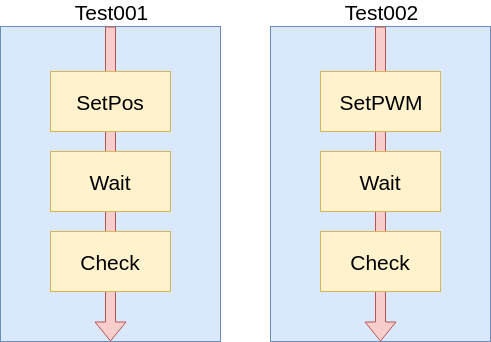

# Block Test

## Introduction

The extension provides functionalities for developing and running not regression tests in a likely natural language as close as possibile to test case writing.
The test philosopy is to divide a test into elementary blocks. The
blocks can be used to build different tests (See Figure below).



## Installation

All system test cames with the superbuild in folder 

```bash
~/isaac-superbuild/isaac/ISAAC/src/tests/isaacBlockTest.
```        

## Test writing


The starting point for writing BlockTests is the file ./test/test.xml

```xml
    <subtestlist repetitions="1">

    <settings robotname="isaacSim" realrobot="false"  onlysimcommands="checkRobotIsVertical checkRobot reset applyForce" simclock="false" positionfor="" neverexecutecommands="" logseverity="info" loggingtime="0.010"/ tablename="test/tables/main.tab">

    <fixture command="yarpserver" param=" --silent" prefix="" kill="true"/>

    <test file="test//test000.xml" repetitions="1" name="Position to 0" note="none"  code="0000" version="1" logginginfo="position L_AK_R"/>
    <test file="test//test001.xml" repetitions="0" name="Straight walking" note="none" code="0001" version="1" logginginfo="position L_AK_R"/>
    <test file="test//test006.xml" repetitions="0" name="Base test apply force x" note="none"  code="0006" version="1" logginginfo="position L_AK_R"/>
    <test file="test//test009.xml" repetitions="0" name="Position to 0" note="none"  code="0009" version="1" logginginfo="position L_AK_R"/>

    </subtestlist>   
```

This file contains the simulation settings, the fixtures and the tests
link list.

## Settings

```xml
    <settings robotname="isaacSim" realrobot="false"  onlysimcommands="checkRobotIsVertical checkRobot reset applyForce" simclock="false" positionfor="" neverexecutecommands="" logseverity="info" loggingtime="0.010"/>
```


The settings are the following:

-   robotname=“isaacSim” &rarr; *Robot name to be used with yarp
    port*

-   realrobot=“false” &rarr; *Indicates if it is a real robot in
    test*

-   onlysimcommands=“checkRobotIsVertical checkRobot reset applyForce”
    &rarr; *Indicates which are the commands to be executed only
    in simulation.*

-   simclock=“true” &rarr; *Indicates if the network clock should
    be used. In the case it is used the one on "/clock" port*

-   neverexecutecommands=“” &rarr; *Indicates which are the
    commands not to be executed.*

-   logseverity=“” &rarr; *Indicates the severity to be logged in log.log.*

-   loggingtime=“” &rarr; *Indicates the time in seconds for logging joint info.*        

-   tablename=“” &rarr; *Indicates the table name for parametric value.*   

## Fixtures for Gazebo

The fixtures are applications to be executed before the tests, if
necessary with parameters. For execute test on Gazebo the following
fixtures are used. The attribute kill means that the current fixture will be killed at the end of the tests. The attribute prefix is the prefix to the command.

```xml
    <fixture command="yarpserver" param=" --silent" prefix="" kill="true"/>
    <fixture command="gzserver" param=" -e ode --profile ode_default -slibgazebo_yarp_clock.so isaac-next-proto-blocktest-yarp.world" prefix="" kill="true"/>
    <fixture command="gzclient " param="" prefix="" kill="true"/>
    <fixture command="isaacWalkingV2" param="--gazeboClock --MPC::max_iter 250 --useUnicyclePlanner 1" prefix="" kill="true"/>
```

## Fixtures for Gazebo and odometry
If you want to check also the position in your test you need odometry that is FloatingBaseEstimator.

```xml
    <fixture command="roscore" param="" prefix="" kill="true"/>
    <fixture command="yarpserver" param="--silent --write --ros" prefix="" kill="true"/>
    <fixture command="gzserver" param="--verbose -e ode --profile ode_default -slibgazebo_yarp_clock.so isaac-next-proto-blocktest-yarp.world" prefix="" kill="true"/>
    <fixture command="gzclient" param="" prefix="" kill="true"/>
    <fixture command="yarpdev" param="--device transformServer --ROS::enable_ros_publisher 1 --ROS::enable_ros_subscriber 1 --transforms_lifetime 0.5" prefix="YARP_CLOCK=/clock" kill="true"/>
    <fixture command="yarprobotinterface" param="--config main-fbe.xml" prefix=""  kill="true"/>
    <fixture command="roslaunch" param="isaac robotStatePublisher.launch" prefix=""  kill="true"/>    
    <fixture command="isaacWalkingV2" param="--gazeboClock --MPC::max_iter 250 --useUnicyclePlanner 1" prefix=""  kill="true"/>
```

   Also you need to install the module check the apropriate guide.

## Fixtures for real robot

If you need to execute the tests on the real robot no fixtures are
necessary.

## Test list

The test list include all the tests written. The test list, basically,
list the tests together with the file in which the test has been written.

```xml
    <test file="test//test000.xml" repetitions="1" name="Position to 0" note="none"  code="0000" version="1" loggingtype="position com"  logginginfo=" L_AK_R R_AK_R"/>
```

-   file=“test//test000.xml” &rarr; *File in which the test is
    written*

-   repetitions=“1” &rarr; *How many times the test is repeated*

-   name=“Position to 0” &rarr; *Test name*

-   note=“none” &rarr; *Test description*

-   code=“0000” &rarr; *Numeric code for identify the test, could
    be related to test case*

-   version=“1” &rarr; *Test version*

-   loggingtype=“position com” &rarr; *Indicates what kind of logging you need. For now it can be "position", "com" or both.* 

-   logginginfo=“position L\_AK\_R” &rarr; *Indicates which
    joint/joints should be logged in position. This logging infos are taken with a sampling rate indicated in loggingtime in setting section. The file has the format: \<test number>-\<joint name>-\<repetition number>*

## Test

The test is written in a separate file. Here is shown an example of a
simple test.
```xml
    <subtestbody>
    <command name="nop" param1="" repetitions="0" wait="0"  reporterror="true"></command>
    <command name="sendpos" jointname="L_AK_R" degree="0" velocity="20" param3="" repetitions="1" wait="0" reporterror="true"></command>
    <command name="sendpos" jointname="R_AK_R" degree="0" velocity="20" param3="" repetitions="1" wait="0" reporterror="true"></command>
    <command name="sendpos" jointname="L_AK_P" degree="0" velocity="20" param3="" repetitions="1" wait="0" reporterror="true"></command>
    <command name="sendpos" jointname="R_AK_P" degree="0" velocity="20" param3="" repetitions="1" wait="0" reporterror="true"></command>
    <command name="sendpos" jointname="L_KN_P" degree="0" velocity="20" param3="" repetitions="1" wait="0" reporterror="true"></command>
    <command name="sendpos" jointname="R_KN_P" degree="0" velocity="20" param3="" repetitions="1" wait="0" reporterror="true"></command>
    <command name="sendpos" jointname="L_HP_P" degree="0" velocity="20" param3="" repetitions="1" wait="0" reporterror="true"></command>
    <command name="sendpos" jointname="R_HP_P" degree="0" velocity="20" param3="" repetitions="1" wait="0" reporterror="true"></command>
    <command name="sendpos" jointname="L_HP_R" degree="0" velocity="20" param3="" repetitions="1" wait="0" reporterror="true"></command>
    <command name="sendpos" jointname="R_HP_R" degree="0" velocity="20" param3="" repetitions="1" wait="0" reporterror="true"></command>
    <command name="sendpos" jointname="L_HP_Y" degree="0" velocity="20" param3="" repetitions="1" wait="0" reporterror="true"></command>
    <command name="sendpos" jointname="R_HP_Y" degree="0" velocity="20" param3="" repetitions="1" wait="0" reporterror="true"></command>            
    </subtestbody>
```  

The test is composed by commands. Here is included a list of the
available commands:

-   prepareStraightWalking

    ```xml
        <command name="prepareStraightWalking" repetitions="1" wait="0" reporterror="true"></command>
    ```

    No params needed

-   startWalking

    ```xml
        <command name="startWalking" repetitions="1" wait="0" reporterror="true"></command>
    ```

    No params needed

-   resetWalking

    ```xml
        <command name="resetWalking" repetitions="1" wait="0" reporterror="true"></command>
    ```

    No params needed

-   wait

    ```xml
        <command name="yarpwait" seconds="5" repetitions="1" wait="0" reporterror="true"></command>   
    ```

    The parameter in seconds, is the wait time in seconds. Could be a double 0.001 means 1 msec.

-   setVelocity

    ```xml
        <command name="setVelocity" xvelocity="0.05" yvelocity="0.00001" repetitions="1" wait="0" reporterror="true"></command>
    ```

    The attributes xvelocity and yvelocity rapesent the velocity in that direction.

-   applyForce

-   reset

    Reset the robot to the original frame position and pose.

    ```xml
        <command name="reset" repetitions="1" wait="0" reporterror="true"></command>
    ```

-   sendpwm
    Send the pwm value to a specific jointname. The pwm profile can be: sin/const/stepwave

    ```xml
        <command name="sendpwm" profile="sin" frequency="1" dutycycle="20" time="20" jointname="L_AK_R" repetitions="1" wait="0" reporterror="true"></command>
    ```

-   sendposdirect

    Send the position to a specific jointname in close loop with direct pos API

    ```xml
        <command name="senddirectpos" jointname="L_AK_R" degree="-30" repetitions="1" wait="0" reporterror="true"></command>
    ```

-   sendpos

    Send the position to a specific jointname in close loop

    ```xml
        <command name="sendpos" jointname="L_AK_R" degree="0" velocity="20" repetitions="1" wait="0" reporterror="true"></command>
    ```

-   checkRobot

    ```xml
        <command name="checkRobot" repetitions="1" wait="0" reporterror="true"></command>
    ```

    Check if joints are present.

-   checkPosition

    ```xml
        <command name="checkPosition" xminposition="0.14" yminposition="0.13" zminposition="0.15" repetitions="1" wait="0" reporterror="true"></command>
    ```

    If the robot position is less than xminposition,yminposition,zminposition the check fails. If the position is 0 it doesn't check on that axis.
    For now only the abs value of the position is checked.

-   checkRobotIsVertical

    ```xml
        <command name="checkRobotIsVertical" repetitions="1" wait="0" reporterror="true"></command>
    ```

    If the robot position is not vertical the check fails

-   sendPwmTrain

    ```xml
        <command name="sendpwmtrain" dutycycle="20" maxposition="20" minposition="-20" cycletime="10" cyclesleep="8" jointname="L_AK_R" repetitions="1" wait="0" reporterror="true"></command>
    ```

    Send a PWM train. Chenge PWM sign when the position is reached


-   nop

    ```xml
    <command name="nop" fixvalue="" tables="kp" printerror="true" printtestinfo="true" justonetime="false" repetitions="1" wait="0" reporterror="true"></command>
    ```

    The nop command is used to print log on the plot.log file.

-   updatefile     

    ```xml
        <command    name="updatefile" 
                sourcefile="./isaac-superbuild/build/isaac/ISAAC/src/tests/isaacBlockTest/test/files/walkingV2PIDparameters.ini" 
                destinationfile="./isaac-superbuild/build/install/share/isaac/robots/isaacNextProtoGazebo/walkingV2PIDparameters.ini" 
                repetitions="1" 
                wait="0"
                reporterror="true">
    </command>```

    The command copy and update the specified file.

-   execute

    ```xml       
	<command    name="execute" 
                command="isaacWalkingV2" 
                param="--gazeboClock --MPC::solver_name mumps --IK::solver_name mumps" 
                prefix="" 
                waitafter="2"
                kill="no"
                repetitions="1" 
                wait="0"
                reporterror="true">
    </command>```

    The command execute the specified application.

Some of the command parameters are common to all commands:
-   name: the name of the command see above. 
-   repetitions: command repetition time.
-   wait: wait in second after the command has been executed.
-   reporterror: if false the command never generate an error. 

## Parametric test

It is possible to execute the same test many times changing one ore more parameters every execution. 

@subsection table-isaacblocktest Table

We use a file, to specify the parameters value and parameters changing rules.

```xml
<settings robotname="isaacSim" realrobot="false"  onlysimcommands="checkRobotIsVertical checkRobot reset applyForce" simclock="true" neverexecutecommands="" logseverity="debug" loggingtime="0.008" tablename="test/tables/main.tab"/> 
```

In the settings section you can find the **tablename parameter** (**main.tab**) that is the file in which
all the tables are written.
Inside of the file  you can find the tables that contain the parameters:

```
(this is the first table)
[
kppos       (table name)
normal      (table type)
1           (increment by time)

40 
50
60
70
80
90
]

(this is the second table)
[
xvelocity   (table name)
increment   (table type)
1           (increment by time)

1           (increment unit)
1           (min)
10          (max)
]
```

Here we have two parameters, kppos and kp in two tables.
It is possibile to specify how the parameters will change during the execution. There are two ways to do so, throught the **table type** parameter.

-   normal:
    in this case the parameter will have the value in the order the values are specified.
    In the above example the kppos parameter will have the value, in order, from
    the first to the last execution 40 50 60 70 80 90

-   increment
    in this case the parameter value will start from the min value to the max value using the
    given increment.

## Using the parameter

In the test you can specify the table name you want to use, the paameter name is surround by 
$:

```xml
 <command name="setVelocity" xvelocity="$xvelocity$" yvelocity="0.5" repetitions="1" wait="0" reporterror="true"></command>
```

In this case the xvelocity parameter will use the table xvelocity.

The test should be executed at least 10 times so:
```xml
    <test file="test//test411.xml" repetitions="10" name="xxx" note="xxx" code="0411" version="1" loggingtype="" logginginfo=""/>
```

## Examples
Not regression tests and example are present in folder test.

## Model settings

World model file is referenced by (See section [fixture](#fixture)):

```xml
    <fixture command="gzserver" param=" -e ode --profile ode_default -slibgazebo_yarp_clock.so ./isaac-next-proto-blocktest-yarp.world" prefix="" kill="true"/>
 ```

The world file is in the isaacBlockTest folder.\
The robot model referenced by the world file is in
isaacBlockTest/isaac-next-proto-blocktest-yarp

Only if you need to execute the tests on Gazebo check if the robot model
is correctly setted. The model is in file:\
*./isaac-next-proto-blocktest-yarp/isaac-next-proto-blocktest-yarp.sdf*\
You can choose one of the following:

-   `<uri>model://isaac-next-proto-yarp-fixed</uri>`

-   `<uri>model://isaac-next-proto-yarp</uri>`

Be sure also to have the fixture in test.xml correctly setted (See
section [fixture](#fixture)).

##  Test execution

To execute the test you should compile the test environment:

-   *cd ./isaac-superbuild/build/isaac/ISAAC/src/test/isaacBlockTest*
-   *make rebuild_cache*
-   *make*
-   *make install*

from ./isaac-superbuild/build/isaac/ISAAC/src/test/isaacBlockTest
and execute:

-   *./isaacBlockTest*

If you need to execute the test on the real robot use the appropriate settings:

```xml
    <settings robotname="isaac" realrobot="true" onlysimcommands="checkRobotIsVertical checkRobot reset applyForce" simclock="false" neverexecutecommands=""/>
```

No fixtures are necessary in this case.

## Logging

Various logging file are present in the system.

## Application logging

Application logging is log/log.log You can read it by:\
*tail -f log.log*

It is possibile to set the logs line to be shown using the attribute  logseverity="debug" inside of the

```xml
    <settings robotname="isaacSim" realrobot="false"  onlysimcommands="checkRobotIsVertical checkRobot reset applyForce" simclock="false" positionfor="" neverexecutecommands="" logseverity="debug"/>
```

The awailable levels are:

    critical = 7
    exception = 6
    error = 5
    warning = 4
    info = 3
    trace = 2
    debug = 1
    none = 0

There are 10 logs used in a circular way.

## Sensors logging

If sensor logging is setted (See section [test list](#testlist)) throught
**position** parameter in loggingtype, the position log file has the format: \<test number>-\<joint name>-\<repetition number>.
If logging is setted throught **com** parameter the position log file has the format: \<test number>-CoM-\<repetition number>.

```xml
    <test file="test//test000.xml" repetitions="1" name="Position to 0" note="none"  code="0000" version="1" loggingtype="position com"  logginginfo=" L_AK_R R_AK_R"/>
```  

## Plot logging

The command **nop** write on the file log/plot.log.

## Report

At the end of the test a report summary is been written:

(2019-05-21 11:43:24.490)(Info*****)====================================\
(2019-05-21 11:43:24.490)(Info*****)===============Report===============\
(2019-05-21 11:43:24.490)(Info*****)====================================\
(2019-05-21 11:43:24.490)(Info*****)Test code:0100 error number:0\
(2019-05-21 11:43:24.490)(Info*****)Test code:0101 error number:0\
(2019-05-21 11:43:24.490)(Info*****)Test code:0102 error number:0\
(2019-05-21 11:43:24.490)(Info*****)Test code:0103 error number:0\
(2019-05-21 11:43:24.490)(Info*****)Test code:0104 error number:0\
(2019-05-21 11:43:24.490)(Info*****)Test code:0105 error number:0\
(2019-05-21 11:43:24.490)(Error****)Test code:0106 error number:2\
(2019-05-21 11:43:24.490)(Info*****)====================================\
(2019-05-21 11:43:24.490)(Info*****)====================================\
(2019-05-21 11:43:24.490)(Info*****)====================================\

@section future-isaacblocktest Future

## Timeout

Timeout for tests, after the timeout the test is failed.

## Specific library writing

## Bugs

None to be signaled

## Authors
* Luca Tricerri ([*personal page*](http://www.iit.it/en/people/Luca-tricerri.html))

*/