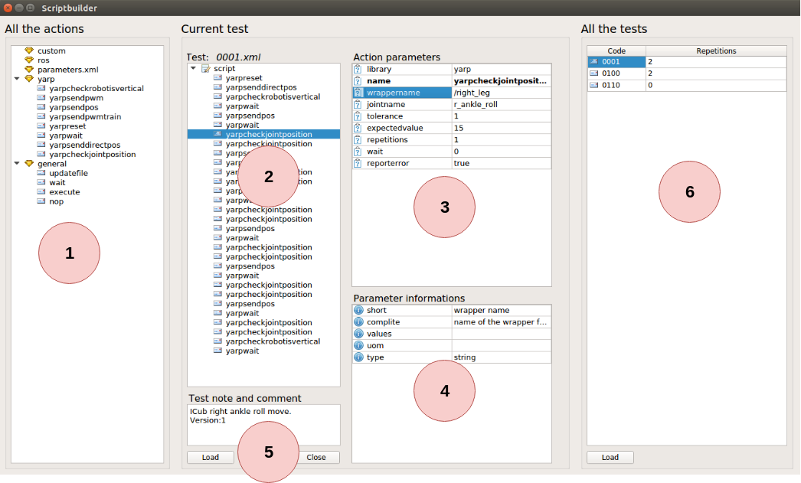

# 1. Script builder

- [1. Script builder](#1-script-builder)
- [2. Introduction](#2-introduction)
- [3. Installation](#3-installation)
- [4. Execution](#4-execution)
- [5. Scriptbuilder section](#5-scriptbuilder-section)
  - [5.1. Actions list section (#1)](#51-actions-list-section-1)
  - [5.2. Test section (#2)](#52-test-section-2)
  - [5.3. Parameters in action](#53-parameters-in-action)
  - [5.4. Parameters info](#54-parameters-info)
  - [5.5. Test info](#55-test-info)
  - [5.6. Tests list](#56-tests-list)
- [6. Writing the test](#6-writing-the-test)
  - [6.1. Write the test](#61-write-the-test)
  - [6.2. Write the test list](#62-write-the-test-list)
- [7. Authors](#7-authors)

# 2. Introduction

Scriptbuilder lets the user to write tests in a simple and safe way.
<br/><br/>

# 3. Installation

It is possible to select the Scriptbuilder compilation and install from cmake.
Take a look at https://github.com/robotology/blocktest/blob/master/README.md
for more details.


# 4. Execution

```bash
./Scriptbuilder
```

# 5. Scriptbuilder section

In the following figure is possible to find the main UI section.



## 5.1. Actions list section (#1)

Section **#1** is the action list. Here are available all the action
in the system divided by libraries.
It is possible to drag and drop the action to the test in section **2**.

## 5.2. Test section (#2)

Section **#2** contains the current test. It is possible to delete (del keyboard), copy and paste the action inside section or drag and drop action from section **#1**.

## 5.3. Parameters in action

Section **#3** shows all the parameters in the selected action in test
in selection **#2**. It is possibile to change the parameters value.

## 5.4. Parameters info

Section **#4** shows all the parameter information in the selected parameter in selection **#3**.

## 5.5. Test info

Section **#5** shows all the selected test informations.

## 5.6. Tests list

Section **#6** shows all available tests. It is possibile to add or delete a test and change test parameters.

# 6. Writing the test

## 6.1. Write the test
The first step is to write the test. You can drag and drop the block from section **#1** to section **#2**.
You can select the block in section **#2** and modify the default parameters in section **#3**. The possibile parameters values and parameters meanings are shown in section **#4**.
You can save your test with the SAVE button.

## 6.2. Write the test list
You can add the new tests in the test list in section **#6**.
To add or delete use the right click context menu on the tests list.
You can save the tests list with the SAVE button.

# 7. Authors
* Luca Tricerri ([*personal page*](http://www.iit.it/en/people/Luca-tricerri.html))


