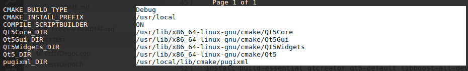
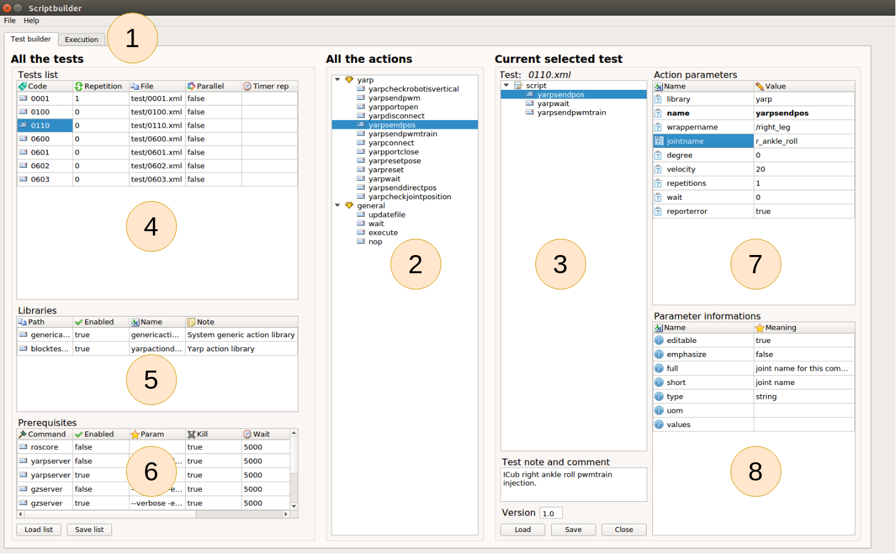
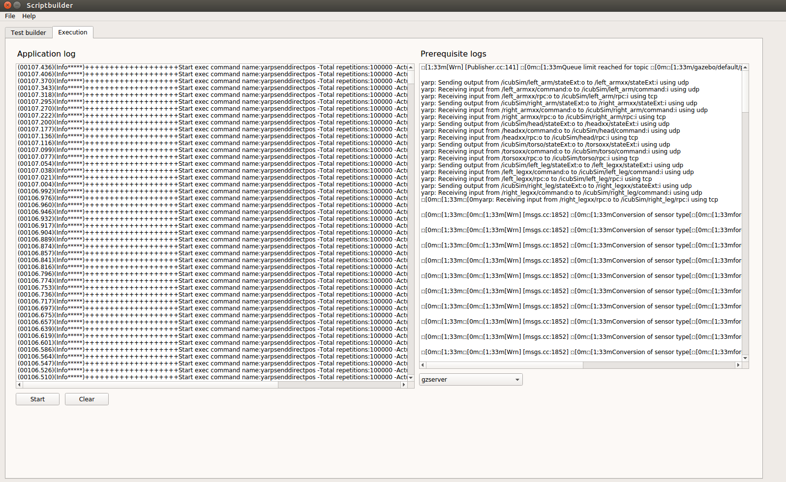

# 1. Script builder

- [1. Script builder](#1-Script-builder)
- [2. Introduction](#2-Introduction)
- [3. Installation](#3-Installation)
- [4. Execution](#4-Execution)
- [5. Scriptbuilder section](#5-Scriptbuilder-section)
  - [5.1. Build or execute tab](#51-Build-or-execute-tab)
  - [5.2. Tests list](#52-Tests-list)
  - [5.3. Actions list section](#53-Actions-list-section)
  - [5.4. Test section](#54-Test-section)
  - [5.5. Parameters in action](#55-Parameters-in-action)
  - [5.6. Parameters info](#56-Parameters-info)
  - [5.7. Tests list](#57-Tests-list)
  - [5.8. Prerequisite list](#58-Prerequisite-list)
  - [5.9. Tests list](#59-Tests-list)
- [6. Writing the test](#6-Writing-the-test)
  - [6.1. Write the test](#61-Write-the-test)
  - [6.2. Write the test list](#62-Write-the-test-list)
- [7. Execute the test](#7-Execute-the-test)
- [8. Authors](#8-Authors)

# 2. Introduction

Scriptbuilder lets the user to write tests in a simple and safe way.
<br/><br/>

# 3. Installation

It is possible to select the Scriptbuilder compilation and install from cmake.
Take a look at https://github.com/robotology/blocktest/blob/master/README.md
for more details.



# 4. Execution

```bash
./Scriptbuilder
```

# 5. Scriptbuilder section

In the following figure is possible to find the main UI section.



## 5.1. Build or execute tab
Section **#9**  build or execute test tab.

## 5.2. Tests list
Section **#6** shows all available tests. It is possibile to add or delete a test and change test parameters.

## 5.3. Actions list section

Section **#2** is the action list. Here are available all the action
in the system divided by libraries.
It is possible to drag and drop the action to the test in section **3**.

## 5.4. Test section

Section **#3** contains the current test. It is possible to delete (del keyboard), copy and paste the action inside section or drag and drop action from section **#2**.

## 5.5. Parameters in action

Section **#7** shows all the parameters in the selected action in test
in selection **#3**. It is possibile to change the parameters value.

## 5.6. Parameters info

Section **#8** shows all the parameter information in the selected parameter in selection **#7**.

## 5.7. Tests list

Section **#4** shows all available tests. It is possibile to add or delete a test and change test parameters.

## 5.8. Prerequisite list

Section **#6** shows all available prerquisites.

## 5.9. Tests list

Section **#6** shows all available tests. It is possibile to add or delete a test and change test parameters.

# 6. Writing the test

## 6.1. Write the test
The first step is to write the test. You can drag and drop the block from section **#1** to section **#2**.
You can select the block in section **#2** and modify the default parameters in section **#3**. The possibile parameters values and parameters meanings are shown in section **#4**.
You can save your test with the SAVE button.

## 6.2. Write the test list
You can add the new tests in the test list in section **#6**.
To add or delete use the right click context menu on the tests list.
You can save the tests list with the SAVE button.

# 7. Execute the test
Enter in Execute tab.
Here is present the start button to start executing the test.
The log can be selected on the combo box on the down right.




# 8. Authors
* Luca Tricerri ([*personal page*](http://www.iit.it/en/people/Luca-tricerri.html))


